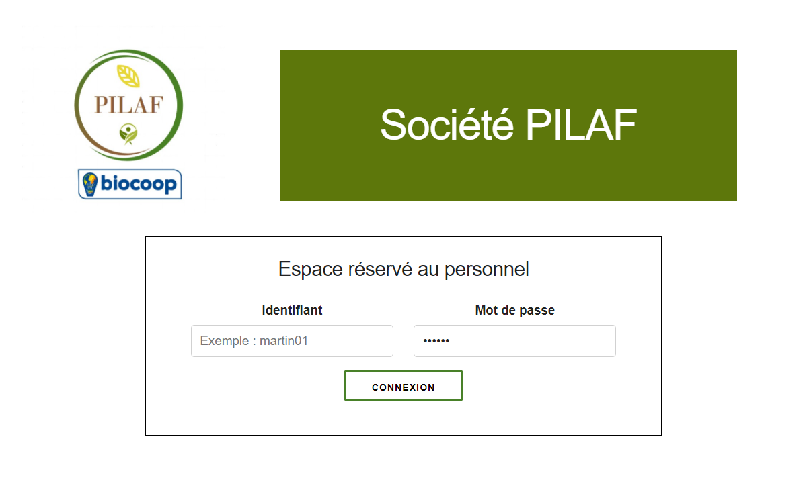
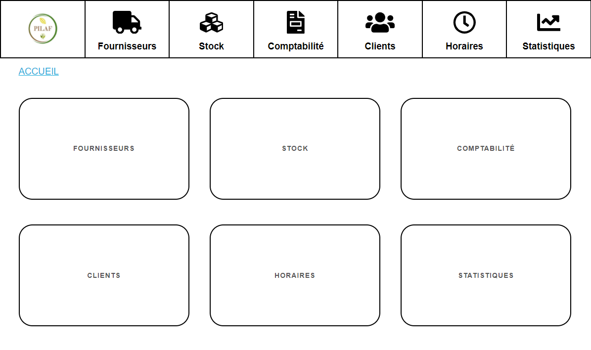
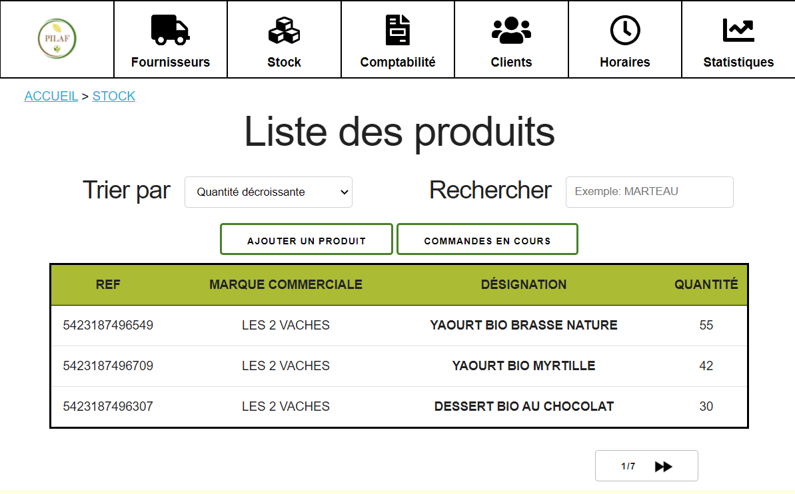

# Magasin-PILAF
Projet réalisé au cours du second semestre de DUT Informatique. 
Ce projet a été élaboré tout d'abord dans le module de gestion de projet avant d'être poursuivi et finalisé lors de notre projet tutoré de première année.

Projet réalisé en collaboration avec Antoine DROUAL, Jean LAURENT, Thomas MARTY 

### Présentation 

Ce projet consistait à créer un petit système d'information pour un magasin BIO "Société PILAF" situé à Limoges. Le client souhaitait retrouver dans notre réalisation une bonne partie des éléments incontournables pour la gestion d'un magasin : 
- Gestion des stocks
- Gestion des fournisseurs
- Gestion des produits
- Gestion des horaires 
- Module de comptabilité
- Elaboration de statistiques  

